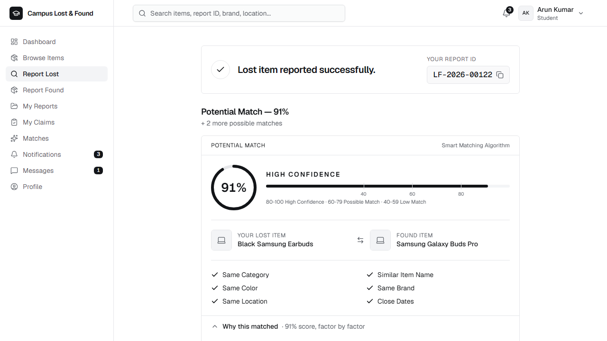
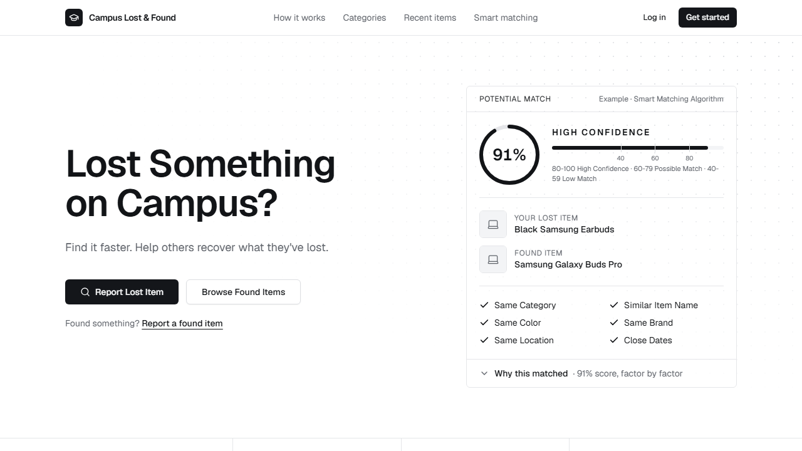
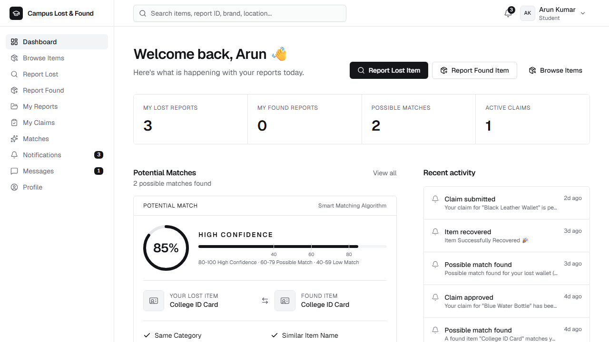
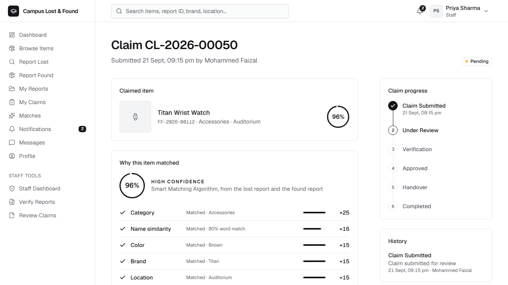
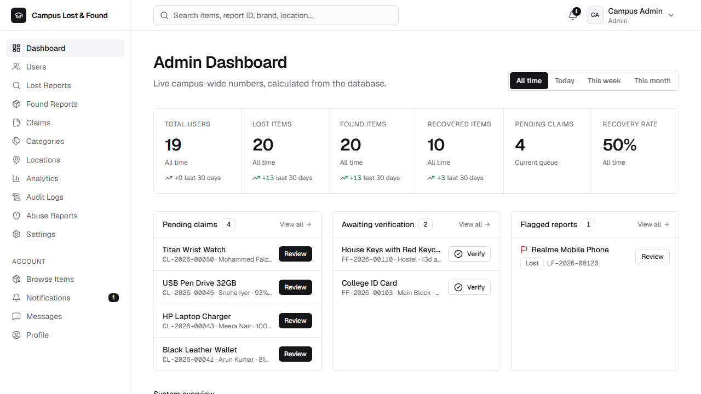

# 🎓 Campus Lost & Found

A full-stack web app where students report lost and found belongings, a **Smart Matching Algorithm** pairs them automatically, and staff verify ownership and hand items back.



## Problem statement

Students often lose valuable belongings on campus, while found items are difficult to connect with their owners. Notice boards and WhatsApp groups are scattered, unsearchable and unverified.

## Solution

One central platform: report lost or found items with photos, get automatic match suggestions with a confidence score and a clear explanation, claim an item, have staff verify the claim, and track the handover until the item is **Recovered**.

## Features

| Area | What works |
|---|---|
| Accounts | Register (validation, duplicate email / ID checks), login with *Remember me*, logout, forgot / reset password, role-based home pages, protected routes with a friendly access-denied page |
| Reports | Report lost / found items, optional photo, report IDs (`LF-2026-00122`, `FF-2026-00103`), drafts, edit, delete. Forms say **Lost Date / Lost Time** or **Found Date / Found Time** |
| Photos | JPG, PNG or WEBP up to 5 MB. Preview, replace, remove, loading state and a fallback when an image cannot be loaded. Wrong type or size always shows: *Please upload a JPG, PNG, or WEBP image under 5 MB.* |
| Browse | Tabs (All / Lost / Found / Recovered), search, filters (category, color, location, building, status, dates), sorting, pagination, shareable URLs |
| Smart matching | Score out of 100, per-factor points ("Why this matched"), confidence bands, runs automatically on every new report, `/matches` page, match notifications |
| Claims | Claim form with optional proof image, staff review (start review, approve, reject, request more information), claimant reply, cancel, status timeline. Approving a claim closes competing claims, and nobody else can claim an item that is waiting for handover |
| Handover | Schedule a handover, receiver confirmation, then the claim is *Completed* and both reports become **Recovered** ("Item Successfully Recovered 🎉") |
| Notifications & messages | Unread badges, per-user preferences, in-app chat with the reporter that never shows phone or email |
| Dashboards | **Student**: quick actions, stats, real potential matches, recent activity. **Staff**: pending verification / claims / approved / handover pending, with the next action on each row. **Admin**: summary cards with a *Today / This week / This month* filter, work queues, system overview panels, five charts, recent activity |
| Admin tools | Users (search, edit, block, delete, role changes with confirmation), reports (verify, flag, change status), claims, categories and locations, analytics, audit log, abuse reports, **Settings** |
| Settings | *General* (application name, institution, contact email, support contact: saved and shown in the header, footer and contact page), *Notifications* (master / claim / match switches, enforced by the server; email is shown as **Not configured**), *Security* (the session and password rules, read-only), *System* (environment, API, database and storage status) |
| Public pages | Landing page with live statistics (items reported, items recovered, recovery rate, average match confidence, all calculated from the database), About, Contact, Privacy, Terms, 404 |
| UX | Responsive (sidebar → drawer + bottom navigation on phones), skeleton loaders, empty / error / retry states, toasts, confirmation dialogs, skip link, labelled controls, visible focus, reduced-motion support |

### Screenshots

| Landing | Student dashboard |
|---|---|
|  |  |
| **Claim review ("Why this item matched")** | **Admin dashboard** |
|  |  |

## Technology stack

- **Frontend:** React 19, Vite, Tailwind CSS 4, React Router, React Hook Form, Lucide icons, Recharts, Geist font (self-hosted)
- **Backend:** Node.js, Express 5, Mongoose
- **Database:** MongoDB (local or MongoDB Atlas)
- **Auth and security:** JWT, bcryptjs, helmet, express-rate-limit, multer (validated uploads)

## Architecture

```
User ──▶ React (Vite) ──▶ Express REST API ──▶ Auth middleware ──▶ Controllers / Services ──▶ MongoDB
```

```
Lost Item ──▶ Matching Service ──▶ Found Items ──▶ Match Score ──▶ Claim ──▶ Verification ──▶ Handover ──▶ Recovered
```

In development the React dev server (`:5173`) proxies `/api` and `/uploads` to Express (`:5000`). In production Express serves the built React app itself, so one service and one URL are enough.

```
campus-lost-found/
├─ frontend/src/
│  ├─ components/   ui.jsx (Button, Input, Modal, Table, Tabs, Timeline, StatCard…), ItemCard, MatchCard, ItemForm, ImageUpload, ClaimModal, Charts
│  ├─ pages/        public + student pages, pages/admin/* (AdminDashboard, StaffDashboard, Settings, Users, Reports, Claims, Analytics…)
│  ├─ layouts/      AppLayout (sidebar, top bar, drawer, bottom navigation, global search)
│  ├─ context/      AuthContext, ToastContext
│  ├─ hooks/        useFetch, useDebounce, useCatalog, useAppSettings
│  ├─ services/     api.js (fetch wrapper, token handling)
│  └─ utils/        format.js (dates, status colors, constants)
├─ backend/
│  ├─ config/       env.js, db.js, policy.js (password / session / upload rules shared by server and UI)
│  ├─ models/       User, LostItem, FoundItem, Claim, Misc (Notification, Message, Category, Location, AbuseReport, AuditLog, Counter, Setting)
│  ├─ controllers/  auth, item (lost / found factory), browse, match, claim, social, admin
│  ├─ routes/       index.js (every route and its role guard)
│  ├─ middleware/   auth (protect / authorize), upload, error
│  ├─ services/     matching.js, itemService.js, notify.js, settings.js
│  ├─ seeds/        seed.js
│  └─ tests/        API tests (node:test)
├─ docs/screenshots/
├─ render.yaml      Render Blueprint (deployment)
├─ SYMPOSIUM_DEMO.md
├─ .env.example
└─ package.json     root scripts
```

## How the Smart Matching Algorithm works

`backend/services/matching.js` → `calculateMatchScore(lostItem, foundItem)` returns `{ score, matchedFields, confidence, breakdown }`. It is a transparent rule-based comparison, not machine learning: every point can be explained.

| Factor | Points | How it is scored |
|---|---|---|
| Category | 25 | Same category (case-insensitive) |
| Item name | 20 | Word overlap (Dice coefficient) after removing filler words and mapping synonyms (`buds` / `earbuds` / `earphones`, `spectacles` / `glasses`, `pendrive` / `usb` …): `20 × similarity` |
| Color | 15 | Any shared color word |
| Brand | 15 | Equal, or one contains the other |
| Location | 15 | Same campus location (8 if only the building matches) |
| Date | 10 | Within 1 day: 10 · 3 days: 8 · 7 days: 5 · 14 days: 2 · otherwise 0 |

**Confidence:** 80–100 **High Confidence** · 60–79 **Possible Match** · 40–59 **Low Match** · below 40 is never shown.

**Example:** lost *"Black Samsung Earbuds"* (Library) against found *"Samsung Galaxy Buds Pro"* (Library, black, within a day): category 25 + name 11.4 + color 15 + brand 15 + location 15 + date 10 = **91 / 100, High Confidence**.

The result page lists the points each factor earned ("Why this matched"), and staff see the same breakdown on the claim. A new lost report is scored against every open found report straight away (owners are notified at 60 and above), and a new found report notifies the owners of matching lost reports.

## Item and claim lifecycle

```
Lost / found report ─▶ match ─▶ claim submitted (found item: Claimed) ─▶ staff review ─▶ Approved (item still Claimed)
                                                                                         └▶ Rejected ─▶ item is available again
Approved ─▶ handover scheduled ─▶ handover completed ─▶ claim Completed, found + lost reports Recovered, owner notified
```

A report is only **Recovered** once the handover is completed, so the recovered counts on the dashboards and the landing page always mean "the owner has the item".

## Roles

| Role | Can do |
|---|---|
| Student | Report, browse, claim, message, notifications, profile |
| Staff | Everything a student can, plus verify and flag reports, review claims, manage handovers (Staff Dashboard) |
| Admin | Everything staff can, plus users and roles, categories and locations, analytics, audit log, abuse reports, report status changes, Settings |

Someone who registers as "Staff" starts as a **Student**. The registration form says so, and an admin sees the request under *Users* and decides. Changing a role always asks for confirmation (*"Are you sure you want to promote this user to Staff?"*); making someone an Admin additionally requires typing `ADMIN`.

## Authentication and security

- Passwords: bcrypt (cost 10); at least 8 characters with upper-case, lower-case and a number. Passwords and reset tokens never appear in any API response.
- Sessions: JWT (HS256 only), valid 1 day, or 30 days with *Remember me*.
- **The role is read from the database on every request.** Blocked or deleted users lose access immediately, and the UI hiding a button is never the only protection: students get `403` from every staff/admin endpoint.
- Rate limits: 600 requests per minute per IP on the API and 100 per 15 minutes on the auth endpoints (only failed logins count towards the login limit). Outside production these limits are relaxed so a demo or a test run can never lock itself out.
- helmet security headers with a strict Content-Security-Policy; JSON body limit; input validation and whitelists on every write (no mass assignment).
- Uploads: type and size checked, the file's real content is verified (magic bytes), stored under random names, and old files are removed when replaced or when the report is deleted.
- Private details (the "unique features" a finder or loser recorded, contact details) are only visible to the reporter and staff.
- **Password reset:** there is no email server. Outside production the API returns the reset link for a clearly labelled *Development only* panel on the Forgot password screen. In production the link is neither returned nor logged, and the screen only says: *If this account exists, a password reset link has been generated.*

## Database design

| Model | Key fields |
|---|---|
| **User** | name, email (unique), password (hashed, never returned), role, studentId (unique), phone, department, year, status (`active` / `blocked`), requestedRole, profileImage, notificationPrefs, savedItems |
| **LostItem** | reportId, userId, itemName, category, description, brand, color, model, uniqueFeatures, date, time, location, building, floor, image, status, flagged, estimatedValue, reward |
| **FoundItem** | the same fields plus currentLocation, foundBy, verifiedBy / verifiedAt; starts as `Pending Verification` |
| **Claim** | claimId, foundItem, lostItem, claimant, answers, evidence, matchScore, status, reviewedBy, reviewComments, handover `{ status, date, location, verifiedBy, receiverConfirmed, completedAt }`, timeline[] |
| **Notification** | userId, title, message, type, link, read |
| **Message** | from, to, text, itemRef, read |
| **Category / Location** | name, enabled |
| **AbuseReport** | itemType, itemId, reporter, reason, details, status. This is the "Report" model from the brief, renamed so it does not clash with lost / found reports |
| **AuditLog** | user, action, target, details |
| **Setting** | one document: appName, institutionName, contactEmail, supportContact, notification switches |
| **Counter** | running numbers for the report and claim IDs |

Item statuses: `Draft`, `Submitted`, `Pending Verification`, `Verified`, `Under Review`, `Matched`, `Claimed`, `Recovered`, `Closed`. Claim statuses: `Pending`, `Under Review`, `Approved`, `Rejected`, `Cancelled`, `Completed`. The collections have indexes for the common lookups, and every model has timestamps.

**Field names:** both item models store the moment of the event in `date` and `time`, so one matching routine and one controller serve both. The UI calls them *Lost Date / Lost Time* and *Found Date / Found Time*, and the API accepts and returns those names too (`lostDate`, `lostTime`, `foundDate`, `foundTime`) next to `date` and `time`.

## API

Every response is `{ success: true, data }` or `{ success: false, message }`.

| Module | Endpoints |
|---|---|
| Public | `GET /api/health` · `GET /api/public/stats` · `GET /api/public/recent` · `GET /api/public/settings` · `GET /api/catalog` |
| Auth | `POST /api/auth/register` · `POST /api/auth/login` · `POST /api/auth/forgot-password` · `POST /api/auth/reset-password` · `GET /api/auth/me` · `PUT /api/auth/profile` · `PUT /api/auth/password` |
| Lost | `GET, POST /api/lost` · `GET, PUT, DELETE /api/lost/:id` |
| Found | `GET, POST /api/found` · `GET, PUT, DELETE /api/found/:id` |
| Browse | `GET /api/items` (lost + found, filtered) · `GET /api/search?q=` · `GET /api/dashboard` · `GET, POST /api/users/saved` |
| Matches | `GET /api/matches` · `GET /api/matches/:lostItemId` |
| Claims | `GET, POST /api/claims` · `GET /api/claims/:id` · `PUT /api/claims/:id` (`under_review`, `approve`, `reject`, `request_info`, `respond`, `cancel`) · `PUT /api/claims/:id/handover` (`schedule`, `complete`) |
| Social | `GET /api/notifications` · `PUT /api/notifications/read-all` · `PUT /api/notifications/:id/read` · `GET, POST /api/messages` · `GET /api/messages/unread` · `POST /api/abuse` |
| Staff + admin | `GET /api/admin/staff` · `GET /api/admin/reports` · `GET /api/admin/claims` · `PUT /api/admin/reports/:type/:id/verify` · `PUT /api/admin/reports/:type/:id/flag` |
| Admin only | `GET /api/admin/dashboard?range=all\|today\|week\|month` · `GET /api/admin/analytics` · `GET /api/admin/users` · `GET, PUT, DELETE /api/admin/users/:id` · `PUT /api/admin/users/:id/block` and `/unblock` · `PUT /api/admin/reports/:type/:id/status` · `GET /api/admin/audit` · `GET /api/admin/abuse` · `PUT /api/admin/abuse/:id` · `GET, PUT /api/admin/settings` · `GET /api/admin/system` · `POST, PUT, DELETE /api/admin/categories` and `/locations` |

## Run it locally

Requirements: Node.js 20.19+ (or 22.12+), and MongoDB running locally or an Atlas connection string.

```bash
# 1. install everything (root + backend + frontend)
npm run install:all

# 2. configure the environment
cp .env.example .env        # then set JWT_SECRET to a long random string

# 3. load the demo data (resets the app collections)
npm run seed

# 4. run the API and the web app together
npm run dev
```

Open **http://localhost:5173**. The API runs on http://localhost:5000. You can also run `npm run backend` and `npm run frontend` separately.

### Environment variables

| Variable | Purpose | Default |
|---|---|---|
| `MONGODB_URI` | MongoDB connection string | `mongodb://127.0.0.1:27017/campus-lost-found` |
| `JWT_SECRET` | Secret for signing tokens (**required**) | none |
| `PORT` | API port | `5000` |
| `CLIENT_URL` | Frontend origin for CORS in development, and the origin used in reset links | `http://localhost:5173` |
| `NODE_ENV` | `production` turns on production behavior (serves the built app, strict rate limits, no reset link) | unset |
| `SEED_DEMO_DATA` | `true` loads the demo data on the first start, only while the database has no users | unset |

### Tests

With the API running on a freshly seeded database:

```bash
npm test --prefix backend
```

37 tests in five files cover the demo flow, authorization, validation, uploads, settings, dashboards and matching. They change data (claims get approved), so run `npm run seed` again before a live demo.

## Demo credentials

| Role | Email | Password |
|---|---|---|
| Admin | `admin@campus.com` | `Admin@123` |
| Student (Arun Kumar) | `student@campus.com` | `Student@123` |
| Staff (Priya Sharma) | `staff@campus.com` | `Staff@123` |

All other seeded students use `Student@123`. The login page also has one-click demo buttons.

Seed data: 15 students (one blocked), 3 staff, 1 admin, 21 lost reports (one draft), 20 found reports, 18 claims across every status, notifications, messages, an open abuse report and an audit trail spread over about five months so the charts are populated.

## Symposium demo

The step-by-step script (student reports the Black Samsung Earbuds → **Potential Match — 91%** → claim → staff approval → handover → **Recovered** → admin analytics) is in **[SYMPOSIUM_DEMO.md](SYMPOSIUM_DEMO.md)**.

## Deploy (Render + MongoDB Atlas, both free)

The repository includes a Render Blueprint (`render.yaml`): one web service builds the React app and serves it together with the API.

1. **Database.** In MongoDB Atlas create a free **M0** cluster (AWS, Singapore, to sit next to Render's Singapore region). Under *Database Access* add a database user. Under *Network Access* allow Render to connect (Render's outbound IP ranges, or `0.0.0.0/0` for a quick demo, in which case the database password is the only protection). Copy the connection string and add the database name before the `?`, for example `mongodb+srv://<user>:<password>@<cluster>.mongodb.net/campus-lost-found?retryWrites=true&w=majority`.
2. **Service.** In Render choose *New → Blueprint*, select this repository, and paste the connection string when it asks for `MONGODB_URI`. `JWT_SECRET` is generated by Render. Apply the Blueprint and wait for the first deploy.
3. **First start.** Because `SEED_DEMO_DATA` is `true`, the first start loads the demo accounts and sample reports (only while the database is empty). Open the `onrender.com` address and log in with the demo credentials above.

Things to know:

- A free Render service goes to sleep after about 15 minutes without traffic; the next request takes up to a minute. Open the site before presenting.
- Uploaded photos are stored on the service's disk, which Render resets on every deploy or restart. The demo data has no photos.
- The demo passwords are public. For anything beyond a demo, delete the `SEED_DEMO_DATA` variable and the demo users, or change their passwords.
- In production the password-reset link is not shown (there is no email server), and the stricter rate limits apply.

## Future scope

AI image similarity · ID-card OCR · email, SMS and push notifications · GPS or map-based location matching · websockets for chat · college ERP / single sign-on integration · cloud image storage.

## Known limitations

- **No email.** There is no SMTP server, so nothing is sent by email and the *Email notifications* switch in Settings is marked *Not configured*. Password reset is therefore a development-only feature: the link is shown on screen outside production and not at all in production.
- **Photos are stored on local disk** (`backend/uploads`). On hosts with a temporary filesystem they disappear on redeploy. Swapping to cloud storage only touches `middleware/upload.js`.
- **Matching is rule-based.** It compares text attributes and dates, not images or meaning.
- **The login token is kept in browser storage** (session storage, or local storage with *Remember me*).
- **Light theme only.**
- **Browse merges lost and found reports in memory.** That is fine for a campus-sized dataset (see the `ponytail:` note in `browseController.js`).
- **Messaging polls** every few seconds; there are no websockets.
- **Browsers:** the app was tested in Chromium (Playwright) at phone, tablet and desktop sizes, with automated accessibility scans (axe-core). It has **not** been tested in Firefox or Safari. There is no automated UI test suite in this repository; the automated tests cover the API.
